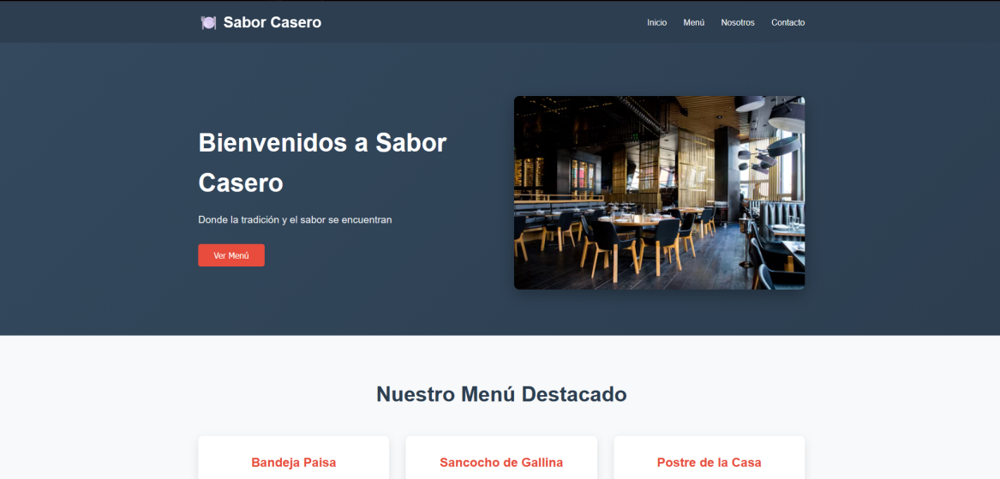
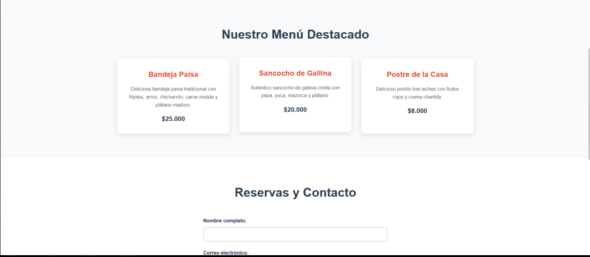
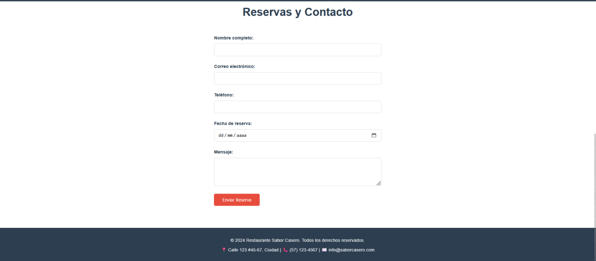

- Nombre del proyecto
Mini App Web

- Integrantes
Geiner Alejandro Cordoba Gonzales y Samuel Steven Combita Muñoz

- Descripción corta.
Mini aplicación web informativa para el Restaurante Sabor Casero, desarrollada como parte de la práctica de Git y GitHub.

- Captura de pantalla de la app.

- Enlace al repositorio.
https://github.com/Geiner2532/miniapp-web

- Fecha de entrega.
29/10/2025